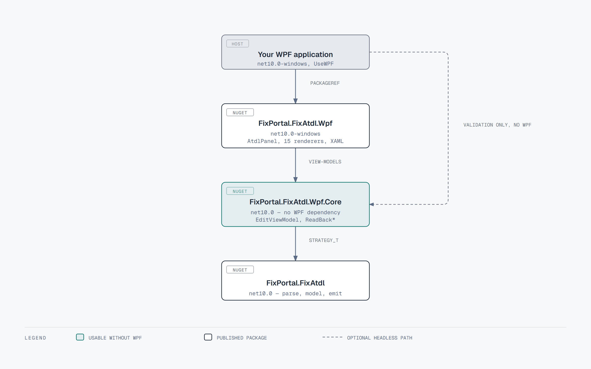

# API reference — `FixPortal.FixAtdl.Wpf`

> Consumer-facing public surface of packages 1.0.x. Walkthroughs stay in
> [usage.md](usage.md). XML documentation files are **not** packed; this
> page is the host contract.



Default control classes under `FixPortal.FixAtdl.Wpf.Controls` are
public because generated XAML references them. Do not construct them
from host code.

## `FixPortal.FixAtdl.Wpf`

| Type | What it is |
|---|---|
| `AtdlPanel.Create(strategy, services)` | Builds the renderable `FrameworkElement` and its `EditViewModel`, sets `DataContext`. Call on the dispatcher. Initialize with `Strategy_t.LoadInitialControlValues` first. |
| `AtdlPanel.Create(strategy, services, isAmendment)` | Same, enforcing `mutableOnCxlRpl="false"`. |
| `AddFixAtdlWpf()` | Registers `StrategyPanelRenderer` and the 15 default `IControlRenderer`s as transients. |
| `IControlRenderer` / `IControlRenderer<T>` | Custom renderer. `ControlType` selects the `Control_t` subclass; `Render` writes XAML through `WpfXmlWriter`. Register after `AddFixAtdlWpf()` — last wins. |
| `StrategyPanelRenderer` | DI-resolved renderer used by `AtdlPanel`. Throws `RenderingException` when the strategy has no layout or no root panel. Merges `FixAtdlWpfResources.xaml` into the parsed view. |

An unrecognised control type reaches the visitor fallback and throws
`NotSupportedException` naming the CLR type and control id.

## `FixPortal.FixAtdl.Wpf.Core.ViewModels`

Usable without the WPF package (`new EditViewModel(strategy)`).

| Type | What it is |
|---|---|
| `EditViewModel` | Coordinates editing, state rules, strategy validation and FIX read-back. `Controls`, `StrategyErrors`, `HasErrors`. Duplicate empty control IDs or duplicate FIX tags throw `ArgumentException`. |
| `EditViewModel.ReadBackFixValues()` | Validated `fixTag → wireValue`. Throws if `HasErrors`. |
| `EditViewModel.ReadBackStrategyParametersGrp()` | Tags 957–960 via core `StrategyParametersGrpEmitter`. Throws if `HasErrors`. |
| `ControlViewModel` | `Value`, `Enabled`, `Visible`, `Visibility` (`"Visible"`/`"Collapsed"`), `IsReadOnly`, `IsRequiredParameter`, `IsContentValid`, `Id`, `FixTag`, `ToolTip`, `UnderlyingControl`, `NumericMinimum`/`NumericMaximum`. Implements `INotifyDataErrorInfo`. |
| `ListControlViewModel` | `Items`, `SelectedValue`, `Text`, `Orientation`, `GroupName`. |
| `ListItemViewModel` | `EnumId`, `UiRep`, `IsSelected`, `GroupName`. Constructed by the list view-model. |

## Namespaces a host imports

```csharp
using FixPortal.FixAtdl.Fix;                    // FixFieldValueProvider
using FixPortal.FixAtdl.Model.Elements;         // Strategy_t
using FixPortal.FixAtdl.Wpf;                    // AtdlPanel, AddFixAtdlWpf
using FixPortal.FixAtdl.Wpf.Core.ViewModels;    // EditViewModel
using FixPortal.FixAtdl.Xml;                    // StrategiesReader
using Microsoft.Extensions.DependencyInjection;
```

## Related packages

- [`FixPortal.FixAtdl`](https://github.com/FixPortal/fixportal-fixatdl/blob/main/docs/api.md) — parser, model, emitter.
- [`@fix-portal/fixatdl-react`](https://github.com/FixPortal/fixportal-fixatdl-react) — browser adapter; not a dependency.

---

<sub>Diagram sources live in [`docs/diagrams/`](diagrams/) as self-contained HTML.
Open one in a browser to edit, then re-export the PNG.</sub>
