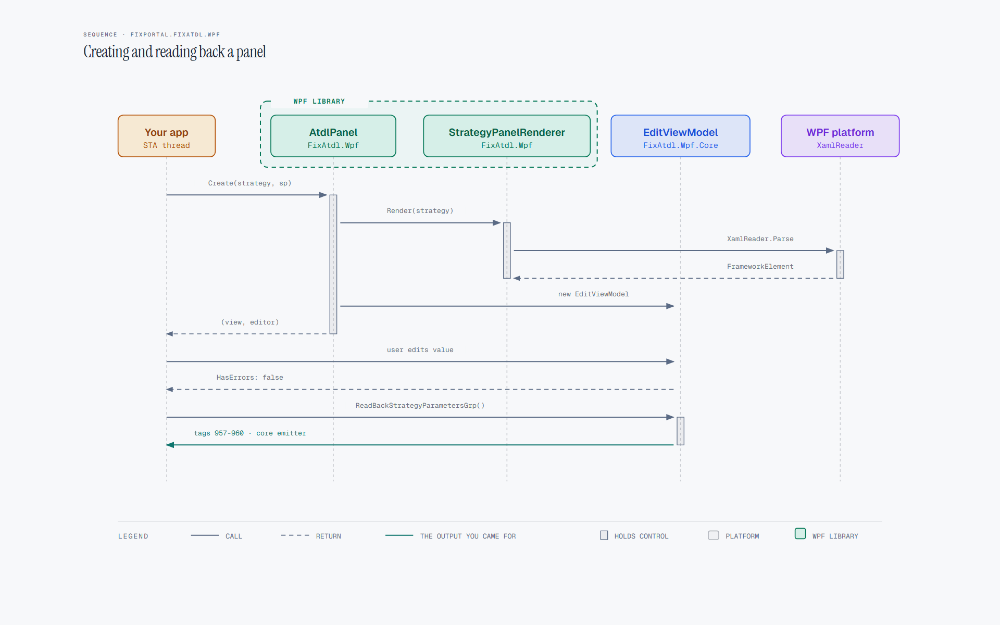

# Using FixPortal.FixAtdl.Wpf

How a WPF host parses a FIXatdl 1.1 document, renders an editable
strategy form, and reads validated FIX tags back out. For the type
list see [api.md](api.md). Parsing, wire conversion and StrategyEdits
belong to
[`FixPortal.FixAtdl`](https://github.com/FixPortal/fixportal-fixatdl/blob/main/docs/usage.md).

Create and use the panel on the WPF dispatcher thread (STA). An editor
owns mutable strategy state: use a separate `Strategy_t` instance for
each open editor.

## Packages

Install `FixPortal.FixAtdl.Wpf`. It pulls in:

| Package | TFM | Role |
|---|---|---|
| `FixPortal.FixAtdl.Wpf` | `net10.0-windows` | Controls, XAML renderer, `AtdlPanel`, `AddFixAtdlWpf`. |
| `FixPortal.FixAtdl.Wpf.Core` | `net10.0` | `EditViewModel` and friends. Usable without WPF if you only want validation and FIX read-back. |
| `FixPortal.FixAtdl` | `net10.0` | Parser / model / emitter. Currently pinned at 1.1.4. |

Target `net10.0-windows` with `UseWPF`. You also need
`Microsoft.Extensions.DependencyInjection`.

## Host a panel



```csharp
using FixPortal.FixAtdl.Fix;
using FixPortal.FixAtdl.Model.Elements;
using FixPortal.FixAtdl.Wpf;
using FixPortal.FixAtdl.Wpf.Core.ViewModels;
using FixPortal.FixAtdl.Xml;
using Microsoft.Extensions.DependencyInjection;

var services = new ServiceCollection()
    .AddFixAtdlWpf()
    .BuildServiceProvider();

var strategies = new StrategiesReader().Load("twap.xml");
Strategy_t strategy = strategies["TWAP"];
strategy.LoadInitialControlValues(FixFieldValueProvider.Empty);

var (view, editor) = AtdlPanel.Create(strategy, services);
contentControl.Content = view;

if (!editor.HasErrors)
{
    IReadOnlyDictionary<int, string> tags = editor.ReadBackFixValues();
    IReadOnlyList<(int Tag, string Value)> grp = editor.ReadBackStrategyParametersGrp();
}
```

`ReadBackFixValues()` is the direct per-parameter tags.
`ReadBackStrategyParametersGrp()` is tags 957–960 for hosts using
`Tag957Support` transport. Both throw
`InvalidOperationException` when `HasErrors` is true. Message
construction, including combining the two, stays with the host.

For an amendment, load the existing order through the core first, then:

```csharp
var (view, editor) = AtdlPanel.Create(strategy, services, isAmendment: true);
```

`mutableOnCxlRpl="false"` values stay disabled. A radio group with an
immutable selected member is locked as a group.

## Validation

`EditViewModel.HasErrors` is true when any control has errors or
`StrategyErrors` is nonempty. `ControlViewModel` implements
`INotifyDataErrorInfo` (`ObservableValidator`); bind with
`ValidatesOnNotifyDataError=true` if you host a control outside the
generated panel. `StrategyErrors` holds strategy-level `StrategyEdit`
failures and non-converging state rules.

Partial clock and spinner text sets `IsContentValid` false until the
value is complete; that surfaces as a field error rather than a thrown
exception.

Duplicate empty control IDs or duplicate FIX tags throw
`ArgumentException` from the `EditViewModel` constructor, before any
XAML is parsed.

## State rules

The view-model applies effects the core only evaluates: enabled,
visible, `{NULL}` clear/restore, cascades, and a bounded cycle that
becomes a strategy error. Visibility binds as `"Visible"` or
`"Collapsed"` (never `"Hidden"`). Last-wins when two of a control's
own rules conflict.

Clock controls pass a time-only value to `Clock_t`; they never pick a
date from the desktop clock. Editing sets seconds to zero. An invalid
`LocalMktTz` is a field error, not a crash. Configure the core clock
before `LoadInitialControlValues` when tests need a fixed "now".

## Theming

**The panel follows its host.** The library owns no palette. Chrome
resolves through the host's own brushes and styles, so a panel embedded in
a themed application inherits that theme - including WPF's Fluent light and
dark - rather than painting over it. Nothing needs configuring for this.

Templates load automatically. `Themes/Generic.xaml` (via `ThemeInfo`) and
each rendered view both merge
`/FixPortal.FixAtdl.Wpf;component/FixAtdlWpfResources.xaml`, which carries
the templates for the library's own control types. Hosts that re-style
should merge that dictionary in `App.xaml` as well, especially if they
host `CheckBoxList` / `RadioButtonList` / `StrategyPanelFrame` outside a
generated panel.

That dictionary deliberately declares **no implicit style for a type the
host owns**. It is merged into the innermost resource scope in the panel's
tree, so a `Style TargetType="ComboBox"` there would shadow the host's own
implicit `ComboBox` style completely - every property, not just the one a
trigger sets. State-dependent chrome uses the `atdl:ErrorCue.HasErrors`
attached property instead: it sets `BorderBrush` and `Foreground` as local
values while a control is invalid and clears them afterwards, so the
property resolves afresh through the host's theme. A custom renderer that
needs an invalid-state cue should do the same.

One brush is the library's own, because Windows has no system equivalent
for it: `ValidationErrorBrush`, the invalid-state border and text. A host
may redefine it.

A required parameter is marked with `*` on its label rather than by colour,
so the requirement survives a colour-blind trader and a theme change alike.
A venue document whose own `label` already ends in `*` gets no second one.

## Custom renderers

`AddFixAtdlWpf()` registers one `IControlRenderer` per FIXatdl control
type. Register your `IControlRenderer<T>` **after** that call — last
registration for a `ControlType` wins. An unrecognised broker control
throws `NotSupportedException` naming the type and id.

A strategy with no layout or no root panel throws
`RenderingException`. Malformed custom XAML throws `XamlParseException`.

## Troubleshooting

| Symptom | Cause | Fix |
|---|---|---|
| `dotnet restore` cannot find `FixPortal.CodeStyle` | Check NuGet.org availability and your local NuGet connectivity; no FixPortal token is required | See [CONTRIBUTING.md](https://github.com/FixPortal/fixportal-fixatdl-wpf/blob/main/CONTRIBUTING.md) |
| `NotSupportedException`: no renderer for control type `X` (id `Y`) | Broker XML uses a type outside the 15 registered renderers | Guard or remap upstream, or add a custom `IControlRenderer` |
| `RenderingException`: no strategy layout / no panels | Strategy XML has no `StrategyLayout`/`StrategyPanel` | Reject the document before `Create` |
| Two editors interfere | An editor owns mutable strategy state | Separate `Strategy_t` instance per open editor |
| `ReadBackFixValues` throws | `HasErrors` is true | Bind `INotifyDataErrorInfo` / show `StrategyErrors` first |
| Immutable values stay disabled on amendment | `isAmendment: true` | Expected. Load the order, then create with `isAmendment: true` |
